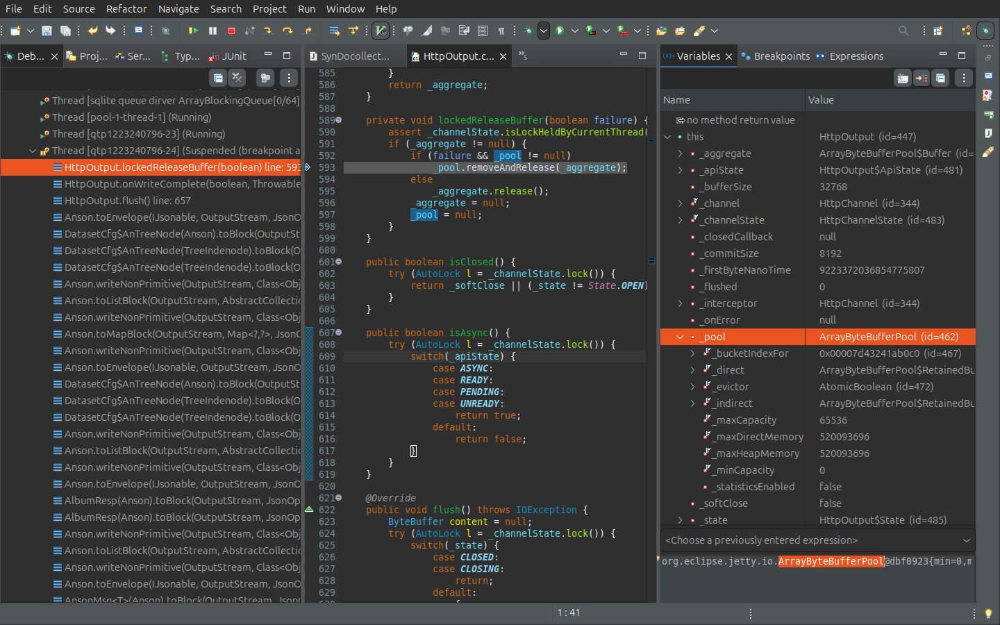

Closed Issues
=============

[closed] To be verified: Different configurations of Ext-filev2
---------------------------------------------------------------

VERIFIED: 2024-12-31

$VOLUME_HUB

.. code-block:: xml

    <s>
        <id>pho.extfile</id>
        <smtc>ef2.0</smtc>
        <tabl>h_photos</tabl>
        <pk>pid</pk>
        <args>$VOLUME_HUB,uri,family,shareby,folder,docname</args>
    </s>

$VOLUME_PRV

.. code-block:: xml

    <s>
        <id>pho.extfile</id>
        <smtc>ef2.0</smtc>
        <tabl>h_photos</tabl>
        <pk>pid</pk>
        <args>$VOLUME_PRV,uri,shareby,folder,docname</args>
    </s>

Different saving paths should still working.

[closed] Jetty NoSuchMethodError: ByteBufferPool.removeAndRelease
-----------------------------------------------------------------

::

    java.lang.NoSuchMethodError: 'boolean org.eclipse.jetty.io.ByteBufferPool.removeAndRelease(org.eclipse.jetty.io.RetainableByteBuffer)'
	at org.eclipse.jetty.ee8.nested.HttpOutput.lockedReleaseBuffer(HttpOutput.java:593)
	at org.eclipse.jetty.ee8.nested.HttpOutput.onWriteComplete(HttpOutput.java:302)
	at org.eclipse.jetty.ee8.nested.HttpOutput.flush(HttpOutput.java:657)
	at io.odysz.anson.Anson.toEnvelope(Anson.java:132)

Jetty HttpOutput class:

.. code-block:: java

    private void lockedReleaseBuffer(boolean failure) {
        assert _channelState.isLockHeldByCurrentThread();
        if (_aggregate != null) {
            if (failure && _pool != null)
                _pool.removeAndRelease(_aggregate);
            else
                _aggregate.release();
            _aggregate = null;
            _pool = null;
        }
    }

Where this._pool is an instance of 

    `org.eclipse.jetty.io.ArrayByteBufferPool <https://javadoc.jetty.org/jetty-12/org/eclipse/jetty/io/ArrayByteBufferPool.html>`_

For `Jetty Server 12.0.16 <https://mvnrepository.com/artifact/org.eclipse.jetty/jetty-server/12.0.16>`_,
ArrayByteBufferPool comes with the method removeAndRelease(...).

Solved with (not verified - break ponts not reached any more)::

    org.eclipse.jetty: jetty-server: jetty-ee8-webapp: 12.0.16 (Dec 11, 2024)
    org.eclipse.jetty: jetty-server: jetty-server    : 12.0.16 (Dec 11, 2024)

[closed] Album.jserv Denpendencies
----------------------------------

Thu Dec 12 12:41:54 2024 +0800

Refactor: move DocsException to semantic.jserv, in the package io...tier.docs, shared by anclient and docsync.

::

        --> albumtier
        ^    |     |
        .    |     +-- anclient.java
        .    |     |    +--[Doclientier,  ...]
        .    |     |    +--[SessionClient ...]
        .    |     |    +--------------------------+
       test  |     |                               |
        ^    +-------- syndoclib (jserv-album-lib) |
        .    |     |    | (protocol: AlbumReq)     |
        .    |     |    +--------------------------+-- semantic.jserv
       jserv-alubm |                                     +-- [DocsException, ExpSyncDoc, ...]
          |        |
          |        |
          +----- docysync (SynssionPeer ...)

[closed] Design Synssion and SyncUser:
--------------------------------------

commit f7c7c8d6bbd3f383d5d4d295059dfabeeb9f861e

Date:   Tue Oct 29 19:41:16 2024 -0400

::

    √ 0. Docsync 0.2.0: config.xml/class-IUser for IUser object used at serverside,
        SynodeConfig by syntity.json's user id is used for Synssion client side, which
        is injected into sysconn while install;
        A SyncUser, admin, is used for domain wide in 0.2.0.
    √ 1. SynDomanager extends SyndomContext, and SyndomContext.load() is called by Syngleton
    √ 2. SynDomanager.loadomx() -> call SyndomContext.loadStampNv(), from which also initializing local robot.
    √ 3. ExpDoctier uses DocUser to represent session's IUser object
    √ 4. SynodeTier also uses a DocUser for initiate a synssion, which is not the same to the
        syn-context's local user, and will trigger unlockx() when logging out.
    √ 5. SyndomContext is responsible for synlock managing.
    √ 6. Simplify Syngleton.syndomanagers
