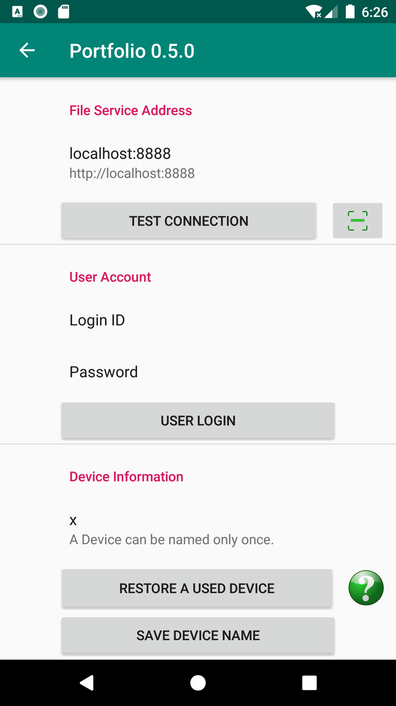
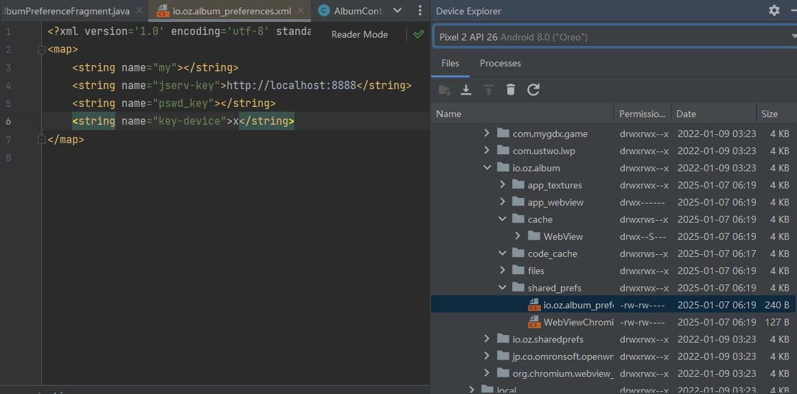

Issues
======

Tireless Doc-ref Resolving
--------------------------

There are reasons, reasonable reasons, that docs be referenced at target synodes
are not reachable, resulting SessionPeer.update2peer() -> resolveRef206Stream()
keeps failing, which will start again and again as long as the syn_docref is not
empty.

What's the reasonable policy to avoid keep printing errors while it's not a
solution if stop trying again anymore?

::

    If a max trying limit is used, when to reset the tried times counter?

To be refined: resolving Doc-ref
--------------------------------

::

    Jun 30, 2025

The concept of passive mode is introduced, and the schema for resolving pushed doc-ref
at passive nodes, e.g. X29, must be resolved by the pushing clients, e.g. Y20, since a
passive node dees not necessarily know the actual jserv of the pushing clients.

Currently there are 2 strategies for these passive doc-ref's resolving:

i. the client remember its tasks while select *refile* when pushing; (can be duplicate)

ii. the client query saved doc-refs at a server to finish its tasks. (already persisted)  

Decision 2025-06-30: the second one looks like more error tolerating and simpler.

FIXEM TODO!!!
_____________

The resolving process, block by block, must check something to make sure the ext-file
is not modified. Somethin like a timestamp is enought. Once it is changed, reset the 
doc-ref's breakpoint to 0. Any ext-file entity updating will clear the corresponding
doc-ref records. 

Setup *jservs* at installation
------------------------------

When the application server is installed, it should know peer jservs, otherwise
the nyq vector matrix won't work.

If a synode is passive (hub-node, e.g. X29), it still need all nodes' ID in settings.jservs,
except the syn_nodes.jserv is never used. 

**Update 2025-06-27**

comments on da2330dae3e085860d637b0e6c077e3cf6992667::

    1. Winsrv cannot update local Ip if changed Wifi settings
    (reboot works, but won't work if booting while wifi is disabled) 

This issue should be considered as a requirements to registration infrastructure.

Only one syn-worker thread
--------------------------

Multiple synodes cannot work in one (test) running.

commit: 2079991c2cfda1a46ac532b94ebb836e41590377

See ExpSynodetier.syncIns().

Overhaul: sending exception to client
-------------------------------------

Re-design ServPort.err(MsgCode code, Exceptiion e);

How long will the syn-worker can work without clean buffered data
-----------------------------------------------------------------

The maximum distance between stamps in syn-change and synode's stamp is half of
Nyquence range, Long.MAX_VALUE, 2 ^ 63 -1 in Java. Each time the stamp will be
increased by 1 for a syn-workers looping. The longest buffering is the difference
of the earliest buffered change logs and the latest stamp.

If each interval is one second, a year has 3.15 * 10 ^ 7 seconds, the longest time
can be correctly buffered is approx. 300 billion years.

Android PreferenceEdit Saves Violate OOP Encapsulation Principle
----------------------------------------------------------------

::

    CompileSDK 34
    TargetSDK 34
    Virtual Device: Pixel 2 API 26
    Tue 07 Jan 2025

When modified PreferenceEdit, the changes are saved to the xml storage after user's
confirmation. To discard the dirty changes next time, the initial value must be reloaded,
which is already lost.

Current solution: use an Anson object to by pass the behavior and only save as needed.

Different FileSystem Providers of JDK 1.8, Windows & Android
------------------------------------------------------------

::

    Jan 05, 2025
    Semantic.DA 1.5.13

Loading text file for jar requires a zip file system provider. This is implemented differently
in JDK 1.8 (Semantic.DA dependency) and Android environment. 

At least API 26, the Zip file system provider is
`not available on Android <https://issuetracker.google.com/issues/153773248?pli=1>`_.

::

    Response from the engineering team:
    =================================

    The missing implementation is com.sun.nio.zipfs.ZipFileSystemProvider, which
    is not available on Android. We recommend using ZipInputStream, which is not
    a replacement but can be used to achieve similar functionality.

Current fixing for loading files from jar package:

TODO Add Tests 2025-01-25 (Antson 0.9.113)::

    1. In deployed server side (Windows), separatlly load zip file within another branch.
    2. In Android, avoid loading zip file.

References

#. Answer by Google AI of search results of "java proper path string format for jdk.zipfs.ZipFileSystem"

    .. code-block:: java

        import java.io.IOException;
        import java.io.InputStream;
        import java.nio.file.*;
        import java.util.HashMap;
        import java.util.Map;

        public class ZipFileExample {

            public static void main(String[] args) throws IOException {
                String zipFilePath = "/path/to/your/zipfile.zip";
                String entryPath = "path/to/file/inside/zip.txt";

                try (FileSystem zipfs = FileSystems.newFileSystem(Paths.get(zipFilePath), null)) {
                    Path pathInZip = zipfs.getPath(entryPath);

                    try (InputStream is = Files.newInputStream(pathInZip)) {
                        // Process the InputStream
                        // ...
                    }
                }
            }
        }

#. Java Documentation, `Zip File System Provider <https://docs.oracle.com/javase/8/docs/technotes/guides/io/fsp/zipfilesystemprovider.html>`_,
Java SE 8 Documentation, Oracle.

#. by Qusay H. Mahmoud, `Compressing and Decompressing Data Using Java APIs <https://web.archive.org/web/20110427091148/http://java.sun.com/developer/technicalArticles/Programming/compression/>`_,
with contributions from Konstantin Kladko, February 2002,
SDN Home / Java Technology / Reference / Technical Articles and Tips
retrieved on 2025-01-25.

TODO To be edit (replace with loadTxt()):

.. code-block:: java

    protected static String loadSqlite(Class<?> clzz, String filename) {
        try {
            // https://stackoverflow.com/a/46468788/7362888
            // URI uri = Paths.get(clzz.getResource(filename).toURI()).toUri();
            URI uri = clzz.getResource(filename).toURI();
            if (
                !eq(uri.getScheme(), "file") &&
                zipfs == null)
                try {
                    Map<String, String> env = new HashMap<>(); 
                    env.put("create", "true");
                    zipfs = FileSystems.newFileSystem(uri, env);
                }
                catch (Exception e) {
                    Utils.warnT(new Object() {},
                        "File %s shouldn't be load in the runtime environment.\ntarget URI: %s",
                        filename, uri);
                    e.printStackTrace();
                    return null;
                }

            uri = Paths.get(uri).toUri();

            return Files.readAllLines(
                Paths.get(uri), Charset.defaultCharset())
                .stream().collect(Collectors.joining("\n"));
        } catch (Exception e) {
            Utils.warnT(new Object() {},
                "File %s can't be loaded in the runtime environment.\n%s",
                filename, e.getMessage());
            e.printStackTrace();
            return null;
        }
    }

Should forcing Radix-32 for syn-uids?
-------------------------------------

To be verified:

Auto-key will generate Radix 64 number in Linux automatically for syn-uids,
which is used as file name prefix and shouldn't be confused across different
platforms. 

File Block Chain vs. DocRef Stream
----------------------------------

::

    May 26 2025

File block chain works will in Portolio 0.7.2 (Semantic.jserv 1.5.16, 
Semantic.DA 1.5.18), but the cons are using a lot of memory at server
side, as all blocks are buffered and updated to database, by semantics
*extfile*. Base 64 file content is committed like a database field. the
intended function, resume at breakpoint, is not implemented.

In May 2025, a new semantics, the DocRef stream, without database semantics
handler, only has Funcalls, is introduced to asynchronously upload file content
and synchronize files. SynssionClient and SynssionServ use this schema for
synchronize files asynchronously.

The pushBlock() schema is planned to replace stream uploading in the future
for breakpoint resumming.

If this object is the reply to client's Doclientier.pushBlock(), clients
can simultaneously upload files in streams mode.

DocRef Stream is used to resolve file reference, while file's json block chains
are used to transfere data. The only possible confliction is extfilev2 triggering
by semantics.DA handler and the DocRef is resolving by a Synode. Since Semantic.DA
1.5.18, ShExtFilev2, the handler, will ignore the field is the content is starting
with an envelope's beginning data::

    {\s*"type":

The Base64 string cannot has such characters like the curely brace ({), double
quotes (") or colon (:). 

**TO DO to be verified**

Currently there is nyquence tag implemented in DocRef. Resources can be conflict if
asynchronously downloading the file, at least will download multiple time in an 
orthogonal data schema. This is to be optmized if it's a serious problem in Portfolio.

Reference

[1] Grok Answer: A Java client for uploading files that can resumming at breakpoints, 

    which is actually the block based style.

    .. code-block:: java

        try (RandomAccessFile file = new RandomAccessFile(localFilePath.toFile(), "r");
             OutputStream outputStream = connection.getOutputStream()) {

            file.seek(startByte);
            byte[] buffer = new byte[BUFFER_SIZE];
            int bytesRead;

            while ((bytesRead = file.read(buffer)) != -1) {
                outputStream.write(buffer, 0, bytesRead);
                bytesSent += bytesRead;

                // Save progress
                Files.writeString(progressFile, String.valueOf(bytesSent),
                        StandardOpenOption.CREATE, StandardOpenOption.WRITE);

                // Report progress
                if (progressCallback != null) {
                    progressCallback.onProgress(bytesSent, totalSize);
                }
            }

            outputStream.flush();
        }

    Conclusion (decision?): To optimize memory usage at the server side, no need to find better
    algorithm other than write a temporary file.