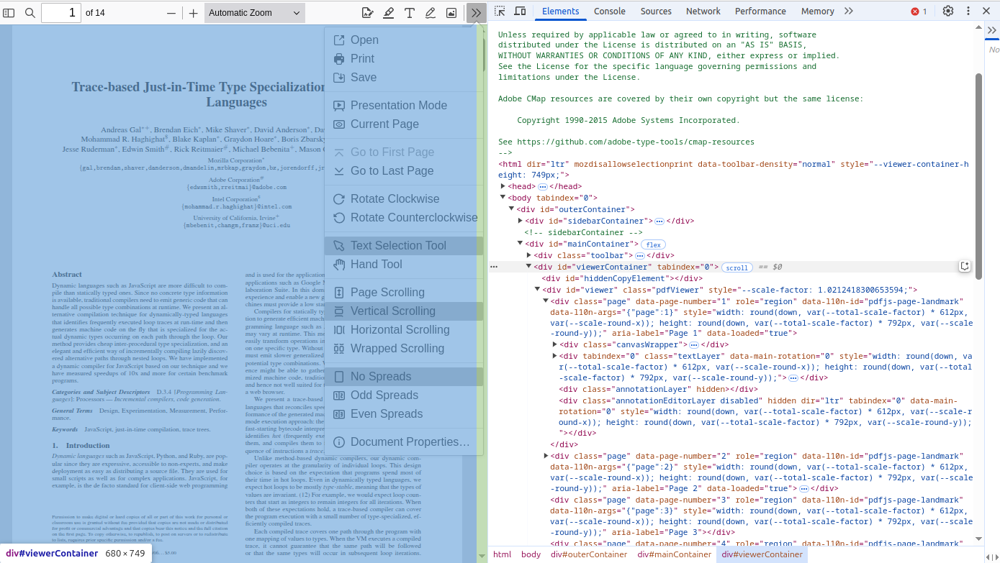

Hacking PDF.js
==============

Source Code: `PDF.js@github <https://github.com/mozilla/pdf.js>`_

Building Example/mobile-viewer
------------------------------

Look like all dependencies are installed by::

    pdf.js/package.json.

Follow the examples/mobile-viewer/README.md:: 

    gulp dist-install
    gulp server

And can only works on local host's browswer?

How the pan events are handled by web/viewer.js
-----------------------------------------------

Source folder: web/viewer.js.

Why? Since the question, `Just need zoom and pan with viewer #17670 <https://github.com/mozilla/pdf.js/discussions/17670>`_
is not answered (23 Mar, 2025).

The Pan events handling can be found in the web/viewer.js example. 

This should run the example, web/viewer.html::

    npm i

Then start a web server in the project root folder.

* Insight

In web/viewer.html:

.. code-block:: html

    <head>
    
    
    </head>

    <body tabindex="0">
        

            
...

 
            

                

                    

                

            

            
...

        

    </body>

The app implementation, PDFViewerApplication from app.js, is managed in viewer.js:

.. code-block:: javascript

    function getViewerConfiguration() {
        return {
            appContainer: document.body, 
            principalContainer: document.getElementById("mainContainer"),

            // The container that GrabToPan transformmed.
            mainContainer: document.getElementById("viewerContainer"),

            viewerContainer: document.getElementById("viewer"),
            ...
        };
    }

    function webViewerLoad() {
        const config = getViewerConfiguration();
        // ...
        PDFViewerApplication.run(config);
    }

    document.addEventListener("DOMContentLoaded", webViewerLoad, true);

app.js:

.. code-block:: javascript

    const PDFViewerApplication = {
        // ...

        async run(config) {
            await this.initialize(config); // bind events, load worker ...
            // ...
        }

        // Called once when the document is loaded.
        async initialize(appConfig) {
            this.appConfig = appConfig;
            await this._initializeViewerComponents();
            //...
        }

        async _initializeViewerComponents() {
            const { appConfig, externalServices, l10n, mlManager } = this;
            const container = appConfig.mainContainer, ...

            // ...

            // NOTE: The cursor-tools are unlikely to be helpful/useful in GeckoView,
            // in particular the `HandTool` which basically simulates touch scrolling.
            if (appConfig.secondaryToolbar?.cursorHandToolButton) {
                this.pdfCursorTools = new PDFCursorTools({
                    container,
                    eventBus,
                    cursorToolOnLoad: AppOptions.get("cursorToolOnLoad"),
                });
            }
        }
    }

pdf_cursor_tools.js:

.. code-block:: javascript

    class PDFCursorTools {
        /**
         * Called by switch toole event handling, 
         *
         * disableActiveTool();
         * this._handTool.activate();
         * @private
         */
        get _handTool() {
            return shadow(
                this,
                "_handTool",
                new GrabToPan({ element: this.container });
            );
        }
    }

Pen events are handled in GrabToPan, where the moving target is the element
parameter in constructor:

.. code-block:: javascript

    class GrabToPan {

        mouseDownAC = null;

        scrollAC = null;

        constructor({ element }) {
            this.element = element;
            this.document = element.ownerDocument;

            // This overlay will be inserted in the document when the mouse moves during
            // a grab operation, to ensure that the cursor has the desired appearance.
            const overlay = (this.overlay = document.createElement("div"));
            overlay.className = "grab-to-pan-grabbing";
        }

        onMouseDown(event) {
            this.scrollLeftStart = this.element.scrollLeft;
            this.scrollTopStart = this.element.scrollTop;
            this.clientXStart = event.clientX;
            this.clientYStart = event.clientY;

            this.mouseDownAC = new AbortController();
            const boundEndPan = this.endPan.bind(this),
            mouseOpts = { capture: true, signal: this.mouseDownAC.signal };

            this.document.addEventListener(
                "mousemove",
                this.onMouseMove.bind(this),
                mouseOpts
            );

            this.document.addEventListener("mouseup", boundEndPan, mouseOpts);
            // When a scroll event occurs before a mousemove, assume that the user
            // dragged a scrollbar (necessary for Opera Presto, Safari and IE)
            // (not needed for Chrome/Firefox)
            this.scrollAC = new AbortController();

            this.element.addEventListener("scroll", boundEndPan, {
                capture: true,
                signal: this.scrollAC.signal,
            });
            stopEvent(event);

            const focusedElement = document.activeElement;
            if (focusedElement && !focusedElement.contains(event.target)) {
                focusedElement.blur();
            }
        }

        onMouseMove(event) {
            this.scrollAC?.abort();
            this.scrollAC = null;

            if (!(event.buttons & 1)) {
                // The left mouse button is released.
                this.endPan();
                return;
            }
            const xDiff = event.clientX - this.clientXStart;
            const yDiff = event.clientY - this.clientYStart;
            this.element.scrollTo({
                top: this.scrollTopStart - yDiff,
                left: this.scrollLeftStart - xDiff,
                behavior: "instant",
            });

            if (!this.overlay.parentNode) {
                document.body.append(this.overlay);
            }
        }

        endPan() {
            this.mouseDownAC?.abort();
            this.mouseDownAC = null;
            this.scrollAC?.abort();
            this.scrollAC = null;
            // Note: ChildNode.remove doesn't throw if the parentNode is undefined.
            this.overlay.remove();
        }
    }

Not working on Android 10
-------------------------

Error::

    Uncaught SyntaxtError: Unexpected Token '{' at line 18046 in pdf.mjs.
    
The lines here are:

.. code-block:: javascript

    class PDFWorker {
        static fakeWorkerId = 0;
        static isWorkerDisabled = false;
        static workerPorts;
        static {            // line 18046
            if (isNodeJS) {
                this.isWorkerDisabled = true;
                GlobalWorkerOptions.workerSrc ||= "./pdf.worker.mjs";
            }
            this._isSameOrigin = (baseUrl, otherUrl) => {
            const base = URL.parse(baseUrl);
            if (!base?.origin || base.origin === "null") {
                return false;
        }

        // ...
    }

Grok::

    The static block (introduced in ECMAScript 2022) is used to initialize static
    properties when the class is first evaluated. However, if the Android WebView
    or the JavaScript environment doesn't support static blocks (e.g., due to an
    older JavaScript engine) ...

This can be fixed by Grok:

.. code-block:: javascript

    // Define static properties and methods outside the class
    const PDFWorkerStatics = {
        fakeWorkerId: 0,
        isWorkerDisabled: false,
        workerPorts: undefined,
    };

    // Initialize static properties and methods
    (function initializePDFWorkerStatics() {
    if (typeof isNodeJS !== "undefined" && isNodeJS) { // Assuming isNodeJS is globally available
        PDFWorkerStatics.isWorkerDisabled = true;
        GlobalWorkerOptions.workerSrc ||= "./pdf.worker.mjs"; // Assuming GlobalWorkerOptions is global
    }

    PDFWorkerStatics._isSameOrigin = (baseUrl, otherUrl) => {
        const base = URL.parse(baseUrl);
        if (!base?.origin || base.origin === "null") {
            return false;
        }
        const other = new URL(otherUrl, base);
        return base.origin === other.origin;
    };

    PDFWorkerStatics._createCDNWrapper = url => {
        const wrapper = `await import("${url}");`;
            return URL.createObjectURL(new Blob([wrapper], {
            type: "text/javascript"
        }));
    };
    })();

    class PDFWorker {
        static fakeWorkerId = PDFWorkerStatics.fakeWorkerId;
        static isWorkerDisabled = PDFWorkerStatics.isWorkerDisabled;
        static workerPorts = PDFWorkerStatics.workerPorts;
        static _isSameOrigin = PDFWorkerStatics._isSameOrigin;
        static _createCDNWrapper = PDFWorkerStatics._createCDNWrapper;

        constructor({
            name = null,
            port = null,
            verbosity = getVerbosityLevel()
        } = {}) {
            // Constructor logic here
        }
        // Rest of the class implementation...
    }

There is a similar issue in pdf.work.mjs. Fixed in f665e6fb.

Fonts not Rendered
------------------

The errors reported in browser console::

    Warning: Error during font loading: Ensure that the `cMapUrl`
    and `cMapPacked` API parameters are provided.

`The similar troubleshooting <https://github.com/wojtekmaj/react-pdf/issues/197#issuecomment-651625440>`_
helped resolving the font resources error:

.. code-block:: typescript

    script.onload = () => {
      console.log('pdf.mjs loaded!');
      let loadingTask: PDFDocumentLoadingTask = pdfjsLib.getDocument({
        url: pdflink,
        cMapUrl: 'https://cdn.jsdelivr.net/npm/pdfjs-dist@5.0.375/cmaps/'
      }) as PDFDocumentLoadingTask;
      // ...
    }

See `pdfjsLib.getDocument() API <https://mozilla.github.io/pdf.js/api/draft/module-pdfjsLib.html>`_::

    Methods
    (inner) getDocument(src) → {PDFDocumentLoadingTask}

    Parameters:
    Name    Type	
    src     string | URL | TypedArray | ArrayBuffer | DocumentInitParameters

    Type Definitions
    DocumentInitParameters
    Document initialization / loading parameters object.
    
    Type: Object
    Properties:
    Name	Type	Attributes	Description
    url		string | URL
    cMapUrl	string	<optional>
    ...

