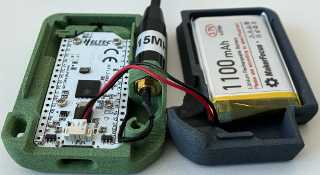
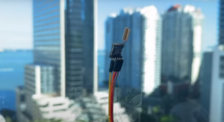

Long Range Wireless Module
==========================

Lora Module SX1276 Tranceiver
-----------------------------

Lora Module SX1276 Wireless Transceiver, Long-Range Wireless Communication(915Mhz)

* `$11.55 at Walmart <https://www.walmart.com/ip/Lora-Module-SX1276-Wireless-Transceiver-Module-Spread-Spectrum-Long-Range-Wireless-Communication-915Mhz/1993105220?wmlspartner=imp_3586222&selectedSellerId=101209505&clickid=zbiRsJ05ZxyKWXc31SRE0XATUkHQXlSLDw-O0w0&irgwc=1&sourceid=imp_zbiRsJ05ZxyKWXc31SRE0XATUkHQXlSLDw-O0w0&veh=aff&affiliates_ad_id=565706&campaign_id=9383&sharedid=>`_

See `experiment with flashable open source packages <https://www.youtube.com/watch?v=9azEfCQNhSA>`_.

    

