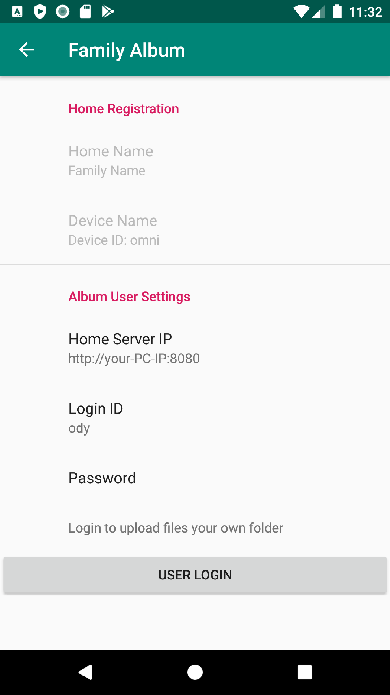

Quick Start (Android)
=====================

Prerequisit
-----------

The Album Synchronizer Android client must run with a server (usually deployed as a family file server).
This server must be installed on a personal computer (only for Windows & Docker).

The server program, Album Service Installer for Windows, `Album_Install.msi <https://github.com/odys-z/semantic-jserv/releases/download/Album-0.5.1/Album_Install.msi>`_
is released as a install file. The lastest version can be found at `here <https://github.com/odys-z/semantic-jserv>`_.
(Please do not confused with other products at the page.)

This program is currently only tested on Windows 10.

Setup
-----

Once the server installed and the service is started up, open Album Synchronizer for Android,
and in the Settings page, setup device Id and user Id.

..

- Set Device Name

Album Synchronizer uses device name to distinguish files from varial file source.
Users must name their device with a unique name in the domain of the file server.

- Login

Login with user Id and password set by server administrator. Once login successfully, please go back to
the home page.

Upload files
------------

In the home page, tap *Add Image*, *Add Video*, *Add Audio* button to select and upload files.
