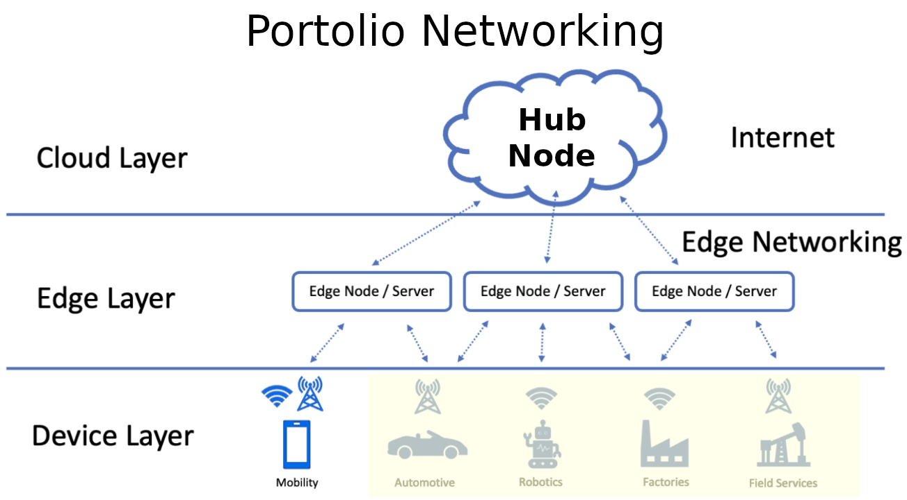

Portfolio 0.7 Preview
=====================

The Android Client
------------------

.. image:: ../imgs/07-portfolio-android-0.5-preview.mp4
    :height: 15em

The Browser Client
------------------

.. image:: ../imgs/07-portfolio-web.png
    :width: 12em

Backend Sychronization
----------------------

* Relational DBMS's automatic sychronization

* Mulitple peer nodes in dynamic networking

* File as external resource based upon Semantic.DA's support.

* Localized Edge Computation

See `Project Docsync.jserv <https://github.com/odys-z/semantic-jserv/tree/master/docsync.jserv>`_
for survey & references.

