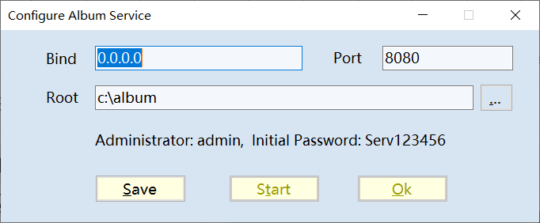
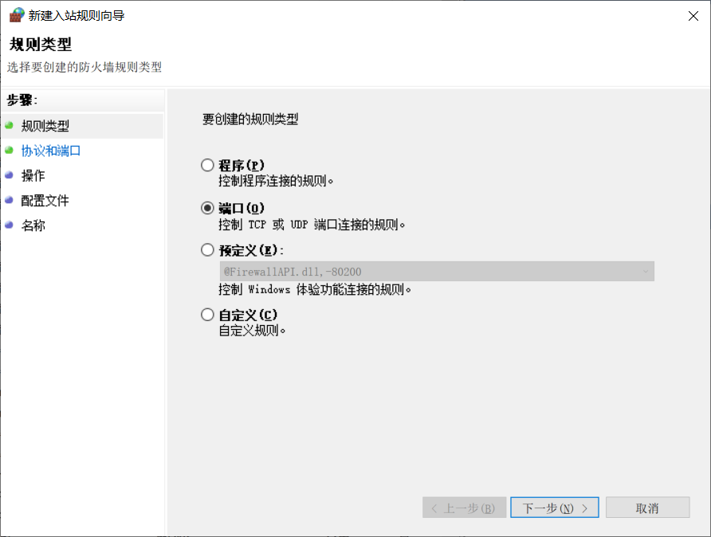

Install Album Server (for Windows)
==================================

1. Download `Winserv_install.msi <https://github.com/odys-z/semantic-jserv/releases/download/Album-0.5.1/Album_Install.msi>`_,
or check lastest version `here <https://github.com/odys-z/semantic-jserv/releases/tag/Album-0.5.1>`_.

2. Run the program

3. Set the service address.

The *bind* field should be the IP address you'd like the clients accessible throw network.
A public IP address can be useful for visiting from internet.

Save the configuration, then click *start* to install and run the service. 

Troubleshootings
----------------

For Windows with Firewall enabled, please make sure your filewall settings allow the port you configured.

`Microsoft Docs <https://docs.microsoft.com/en-us/sql/reporting-services/report-server/configure-a-firewall-for-report-server-access?view=sql-server-ver15#opening-ports-in-windows-firewall>`_

.. image:: ../imgs/windows-firewall-0.png
    :width: 200px

.. image:: ../imgs/windows-firewall-2.png
    :width: 200px
