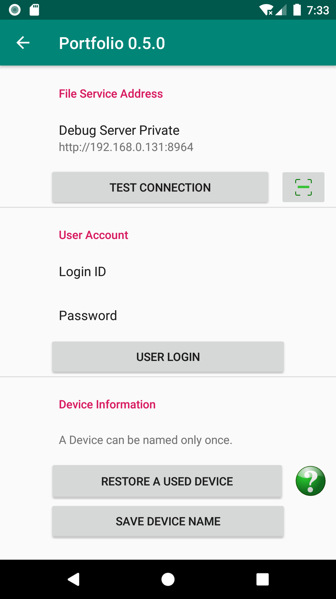

Quick Start
===========

Prerequisit
-----------

The Portfolio Android client must run with a server which is usually deployed as
a family file server. This server must be installed on a personal computer
(requires Python 3.9 and JDK 17).

The server program, Portfolio Synode,
`jserv-album-0.7.#.zip <https://github.com/odys-z/semantic-jserv/releases/tag/portfolio-synode-0.7.0>`_
is released as an excutable on Python 3 and JDK 17.

See :ref:`How to setup Portfolio Synode <setup-synode>`, the private file server.

.. _setup_android:

Setup Protfolio Android
-----------------------

Once the server installed and the service is started up, open Portfolio for Android,
and in the Settings page, setup device Id and user Id.

..

- Set Device Name

Portfolio uses device name to distinguish files from various file sources.
Users must name their device with a unique name in the domain of the file server.

- Login

Login with user Id and password set by server administrator. Once login successfully,
please go back to the home page.

Upload files
------------

In the home page, tap *Add ...* button to select and upload files.
