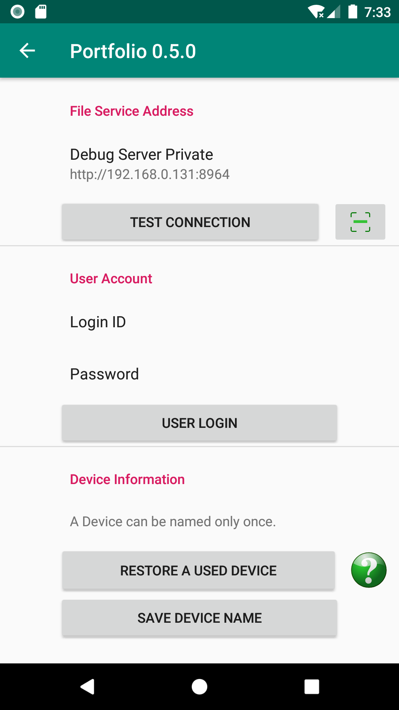

Quick Start
===========

Prerequisit
-----------

The Portfolio Android client uploads files to any domain server which is usually
deployed as the community's file server. The service nodes must be already setup.

See :ref:`How to setup Portfolio Synode <setup-synode>`, the private file server.

.. _setup_android:

Setup Protfolio Android
-----------------------

Once the server installed and the service is started up, open Portfolio for Android,
and in the Settings page, setup device Id and user Id.

..

- Set Device Name

Portfolio uses device name to distinguish files from various file sources.
Users must name their device with a unique name in the domain of the file server.

- Login

Login with user Id and password set by server administrator. Once login successfully,
please go back to the home page.

Upload files
------------

In the home page, tap *Add ...* button to select and upload files.
