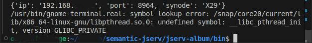

Troubleshootings
================

.. _install-anson-py3:

- Failed to install portfolio-synode
  
  Error::

    ERROR: Could not find a version that satisfies the requirement anson.py3 (from portfolio-synode) (from versions: none)

  Portfolio-synode requires a module which is still not published in PyPI. Install with this command:

    pip install --index-url https://test.pypi.org/simple --extra-index-url https://pypi.org/simple anson.py3

  If have to remove a package installed by a previous python version, e.g. installed by python 3.9, uninstall it with::

    pip3.9 uninstall portfolio-synode 

- Windows Network Firewall / Defender

For Windows with Firewall enabled, please make sure your filewall settings allow the port you configured.

`Microsoft Docs <https://docs.microsoft.com/en-us/sql/reporting-services/report-server/configure-a-firewall-for-report-server-access?view=sql-server-ver15#opening-ports-in-windows-firewall>`_

.. image:: ../../../album/source/imgs/windows-firewall-0.png
    :width: 200px

.. image:: ../../../album/source/imgs/windows-firewall-1.png
    :width: 200px

.. image:: ../../../album/source/imgs/windows-firewall-2.png
    :width: 200px

.. _trouble-vscode-linux:

- Run with VS Code in Linux

**Only tested in Ubuntu 24.04**

To run Portfolio-synode from VS Code terminal in Ubuntu / Linux will result
in errors like `the report #179274 <https://github.com/microsoft/vscode/issues/179274>`_.

This error can be avoid by running like this::

    export GTK_PATH= && python3 -m portfolio-synode

which is strongly discuraged as this is not fully tested.